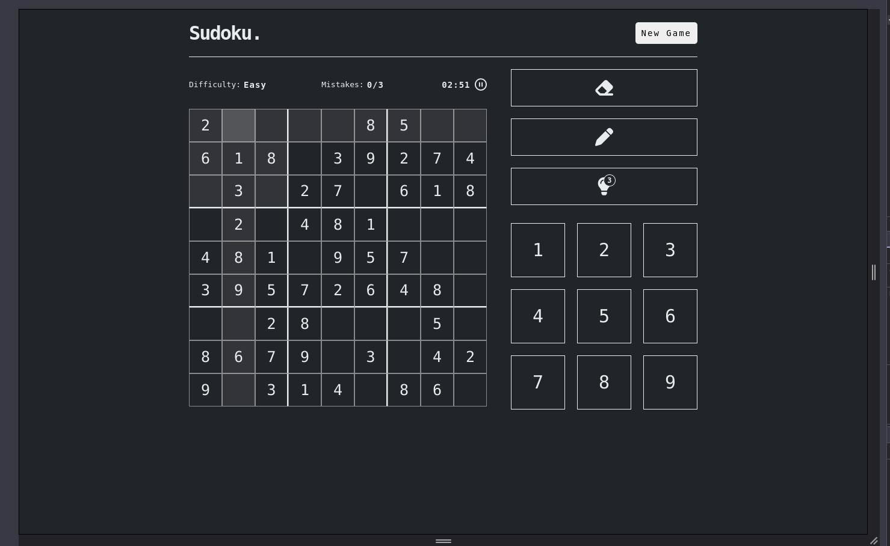
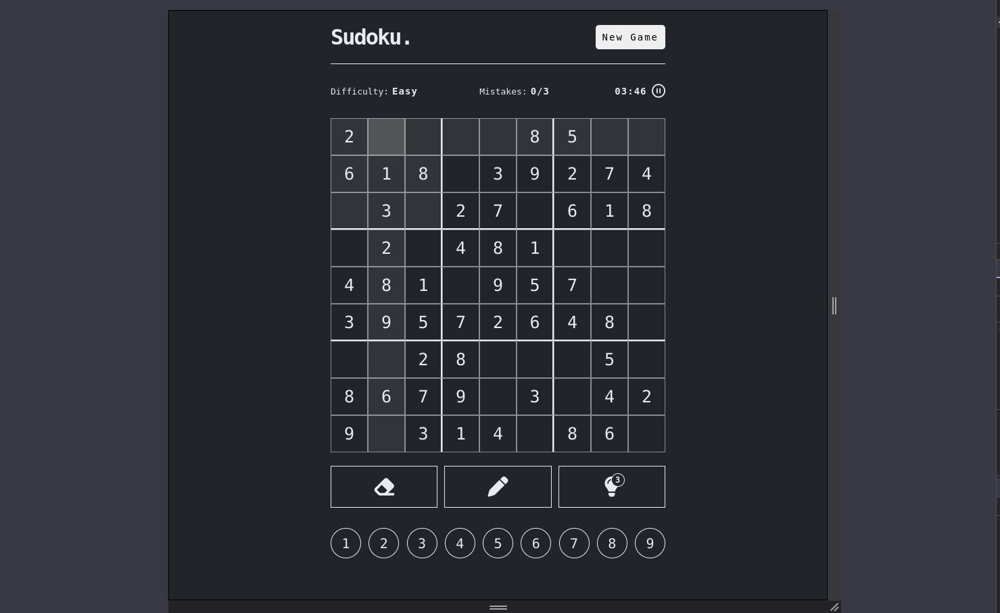

# Sudoku Game

## Description
This is a fully functional web-based Sudoku game built with HTML, CSS, and JavaScript. It features an interactive board where users can solve puzzles, track time, and manage mistakes. The game includes multiple difficulty levels, hints, and a timer to make the gameplay challenging and engaging.

---

## Features

- **Dynamic Sudoku Board**: A 9x9 grid where users can interact by clicking cells and entering numbers.
- **Difficulty Levels**: Choose between Easy, Medium, and Hard levels that control how many cells are empty in the puzzle.
- **Timer**: Tracks the player's time and pauses/resumes as needed.
- **Mistakes Counter**: Users are allowed up to 3 mistakes. After the third mistake, the game ends.
- **Hints**: Users can use up to 3 hints to help them solve the puzzle.
- **Notes Mode**: Players can toggle a notes feature to keep track of possible numbers for each cell.
- **Responsive Design**: The game adjusts to different screen sizes for optimal play on both desktop and mobile.

---

## Images

<div style="display: flex; gap: 20px;">
    
    
</div>

---

## Installation

1. Clone the repository:
    ```bash
    git clone https://github.com/yourusername/sudoku-game.git
    ```

2. Navigate to the project directory:
    ```bash
    cd sudoku-game
    ```

3. Open the `index.html` file in your browser to start playing the game.

---

## How to Play

1. **Start a New Game**: Click on the "New Game" button to select the difficulty and generate a new puzzle.
2. **Select a Cell**: Click on any cell to make it active. Related cells in the same row, column, or 3x3 sub-grid will be highlighted.
3. **Enter a Number**: Click a number from the number pad to enter it into the active cell. If you're not sure, you can use the "Notes" feature to make notes in the cells.
4. **Mistakes**: If you enter the wrong number, a mistake counter will increase. After 3 mistakes, the game ends.
5. **Hints**: Use the "Hint" button to get help for one of the cells.
6. **Timer**: Track your time as you solve the puzzle. You can pause or resume the timer at any point.

---

## Technologies Used

- **HTML5**: Markup for the game board and interface.
- **CSS3**: Styling for the game layout and responsiveness.
- **JavaScript**: Logic for handling the game mechanics, puzzle generation, and interactions.

---

**Enjoy playing Sudoku!**